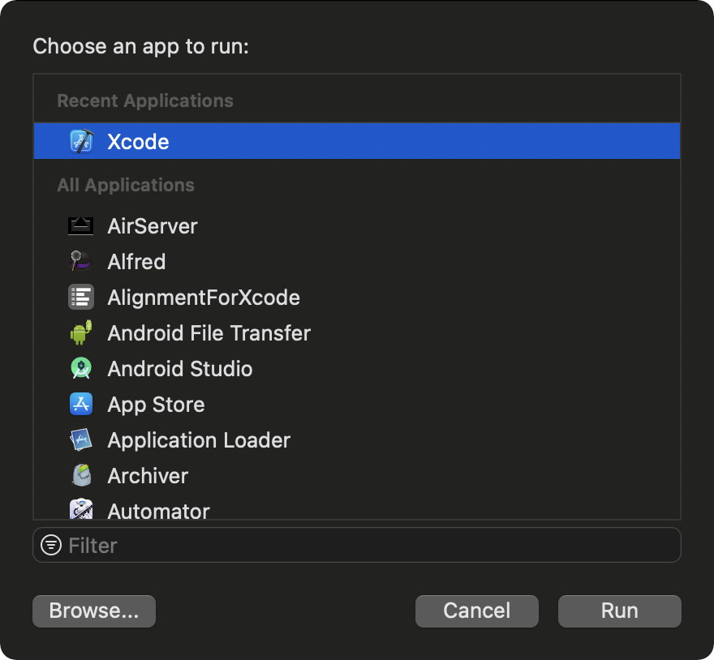

这是个XCode Source Extension 用于自动将JSON转化为模型
# 从零开始 编写一个 XCode Source Extension 

先看最终效果图：


就像你看到的，这个插件包括两个模块，一个是设置页面我们使用Mac APP 完成(不需要Mac开发基础)，另一部分是Xcode source Editor插件。这两个模块我们均用swift进行开发。

第一步：开始创建项目，创建一个Mac APP

然后为项目取名为`DKJSONExtension`开发语言为swift使用storyboard。
这时候我们就创建好了主项目了，运行以后是一个空白的窗口。我们先实现设置功能的页面，在进行xcode source editer插件的开发。首先我们打开storyboard
修改一下主程序窗口的标题

接着在viewcontroller中拖出设置页面，为了方便布局我使用两个stackview去横向排列3个选项

设置界面完成以后就可以进行事件处理了，设置页面主要是为了显示和修改当前的模型类型和命名规则。这里我们使用`UserDefaults`存储数据
为了和storyboard中的控件交互这里我们使用两种常用的方式获取控件第一种使用`@IBOutlet` 引用，第二章通过设置`tag`取subview

我们要实现单选按钮需要在按钮的点击事件中自己处理.为同一行的按钮做一个事件处理，并且存储当前的值
```swift
@IBAction func modeTypeChange(_ sender: NSButton) {
        [codeableBtn,handyJSONBtn,swiftyJSONBtn].forEach {
            $0?.state = sender.title == $0?.title ? .on : .off
        }
        UserDefaults.modelType = sender.title 
    }

    @IBAction func modeNameStyleChange(_ sender: NSButton) {
        for i in 0..<3 {
            let btn = self.view.viewWithTag(100 + i) as? NSButton
            btn?.state = sender.title == btn?.title ?.on:.off
        }
        UserDefaults.modelStyle = sender.title
    }
```
这样我们做好了事件处理和数据存储，这里我们存储数据需要和extension共享为此我们使用APP group进行userdefault 存取。如果使用`UserDefaults.standard`进行存取我们将无法在extension中获取到存取的值。
具体步骤如下：
到开发者中心创建APP group

选择 APPgroup 填写名称和标识
创建完成打开
如图复制identifier

在项目中添加APPgroup,天上刚才复制的identifier

这时我们就能按group存取数据了，这些数据将会被同一group的应用共享。我们为userdefault 添加扩展.注意要使用groupID创建userdefault
```swift

extension UserDefaults{
    static var grouped:UserDefaults{
        return UserDefaults(suiteName: "group.com.dkjone.DKJsonExtension") ?? standard
    }
    /// 模型类型
    static var  modelType: String {
        get { return grouped.string(forKey: #function) ?? "HandyJSON" }
        set { grouped.setValue(newValue, forKey: #function) }
    }
    // 命名规则
    static var modelStyle: String {
        get { return grouped.string(forKey: #function) ?? "驼峰法" }
        set { grouped.setValue(newValue, forKey: #function) }
    }
}
```
最后一步，设置页面加载时，显示当前存储的设置数据
```swift 
 override func viewDidLoad() {
        super.viewDidLoad()
        [codeableBtn,handyJSONBtn,swiftyJSONBtn].forEach {
            $0?.state = UserDefaults.modelType == $0?.title ? .on : .off
        }
        for i in 0..<3 {
            let btn = self.view.viewWithTag(100 + i) as? NSButton
            btn?.state = UserDefaults.modelStyle == btn?.title ?.on:.off
        }
    }
```
到此我们完成了设置应用的全部功能
接下来我们实现source editor extension部分
这部分我们首先创建extension如图：

创建完成以后我们项目中多呢以下文件
```
-- JSONExtension
---- SourceEditorExtension.swift
---- SourceEditorCommand.swift
---- Info.plist
```
这几个文件是我们编写extension的关键。我们的 项目 target也会多一个选项,我们使用如下选项运行就会出现一个灰色的xcode 可以让我们调试，用灰色xcode 打开文件便会在editor菜单中出现我们添加的插件名称。
如果你出现报错
```
dyld: Library not loaded: @rpath/XcodeKit.framework/Versions/A/XcodeKit
  Referenced from: 
```
说明库连接有问题，找到这个库链接删除后按图添加即可

出现以下错误是账号问题需要到xcoed->preferencces->account 中，删除之前的账号，重新登陆账号就可以了
```
"Your session has expired. Please log in."
```
如果成功运行会出现灰色Xcode


用灰色的xcode打开文件或者项目在editor 菜单最下面就会有我们新建的插件了，在此之前我们修改下插件的菜单名称
可以在info.plist中修改也可以在代码中自定义，我们直接修改代码中的返回值，修改返回值优先级高于info.plist,
修改`SourceEditorExtension.swift`文件为以下内容
```swift 
class SourceEditorExtension: NSObject, XCSourceEditorExtension {
    var commandDefinitions: [[XCSourceEditorCommandDefinitionKey: Any]] {
        return [[.nameKey: "将JSON文件转化模型", .identifierKey: "paraseFile", .classNameKey: SourceEditorCommand.className()],
                [.nameKey: "从剪贴板获取JSON转化为模型", .identifierKey: "parasePasteboard", .classNameKey: SourceEditorCommand.className()]]
    }
}
```
要注意的地方：
> **nameKey:** 菜单的名称
> **identifierKey:** 菜单的标识，可以在处理类中用于判断点击了哪一个菜单
> **classNameKey:**  处理此菜单的类名，这里我们直接使用`className()`获取，如果你直接写字符串记得在类名前加上模块名。

到此我们直接运行后就是以下的效果了


最后我们需要处理如何生成代码了：
打开处理类
```swift
class SourceEditorCommand: NSObject, XCSourceEditorCommand {
// 点击菜单时调用的方法
 func perform(with invocation: XCSourceEditorCommandInvocation, completionHandler: @escaping (Error?) -> Void) {
 }
}
```

这里方法的参数`invocation`就是当前编辑的上下文可以获取当前菜单的ID和当前文档类型，文档内容，所在行号等等。
如果需要修改文件内容直接修改`invocation.buffer.lines`就可以。这是个`[Sting]`类型的可变数组，可以在后面直接加，也可以替换某一行内容。
为了获取主程序保存的配置我们也要为这个extension配置相同的APP group，方法同上。也使用相同的userdefault就可以取出主程序存储的配置了。

这里具体解析json的逻辑就不仔细说明了，有兴趣的查看供完整的源码

最后一步发布我们制作的插件。选择主项目，然后xcode->product->archive 接下来和发布IOS应用一样可以选择开发者签名或者提交到APP store 或者内部测试。导出内容如图:

如果想制作图中的dmg文件，打开`磁盘工具`->文件->新建映像->基于文件夹新建->选择插件所在文件夹即可。使用时将其中的APP文件(上图圈中的)拖入application文件夹后打开。记得一定要打开一次，然后到`系统偏好设置`->`扩展`中勾选这个插件就可以了

这样我们就可以正常使用这个extension了